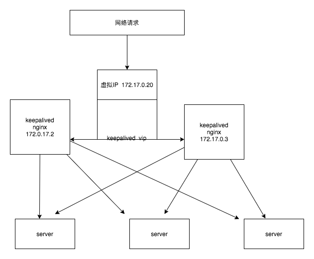

# 拓扑图




# 主从模式

```
docker  pull  centos  #获取centos 镜像
docker  run  -tid --name centos  centos #启动镜像
docker exec  -it centos  bash
yum install -y  vim  net-tools gcc openssl-devel popt-devel keepalived  nginx
vim  /etc/keepalived/nginx_check.sh $新增nginx 进程检查
#!/bin/bash
counter=$(ps -C nginx --no-heading|wc -l)
if [ "${counter}" = "0" ]; then
    /usr/sbin/nginx
    sleep 2
    counter=$(ps -C nginx --no-heading|wc -l)
    if [ "${counter}" = "0" ]; then
        /etc/init.d/keepalived stop
    fi
fi
docker  commit  centos centos  
#重启镜像
docker run --privileged  -tid --name master centos /usr/sbin/init
docker  exec  -ti master  bash
echo 'welcome  to nginx  master' > /usr/share/nginx/html/index.html
vim  /etc/keepalived/keepalived.conf

vrrp_script chk_nginx {
        script "/etc/keepalived/nginx_check.sh"
        interval 2
        weight -20
}


vrrp_instance VI_1 {
    state MASTER
    interface eth0
    virtual_router_id 51
    priority 100
    advert_int 1
    authentication {
        auth_type PASS
        auth_pass 1111
    }
    virtual_ipaddress {
				172.17.0.20
    }
}

systemctl daemon-reload
systemcl  start keepalived.service
nginx  #启动ngxin

#重启salve 服务器
docker run --privileged  -tid --name salve centos /usr/sbin/init
docker  exec  -ti salve  bash
echo 'welcome  to nginx  salve' > /usr/share/nginx/html/index.html
vim  /etc/keepalived/keepalived.conf

vrrp_script chk_nginx {
        script "/etc/keepalived/nginx_check.sh"
        interval 2
        weight -20
}


vrrp_instance VI_1 {
    state SALVE
    interface eth0
    virtual_router_id 51
    priority 99
    advert_int 1
    authentication {
        auth_type PASS
        auth_pass 1111
    }
    virtual_ipaddress {
				172.17.0.20
    }
}

systemctl daemon-reload
systemctl  start keepalived.service
nginx  #启动nginx

# master  salve 都存活
curl 172.17.0.20 # master
welcome to nginx  master
curl 172.17.0.20 # salve
welcome to nginx master

#关闭master
systemctl stop keepalived.service
curl 172.17.0.20 # master
welcome to nginx  salve
curl 172.17.0.20 # salve
welcome to nginx salve


#开启 master
systemctl start keepalived.service
curl 172.17.0.20 # master
welcome to nginx  master
curl 172.17.0.20 # salve
welcome to nginx master

```


